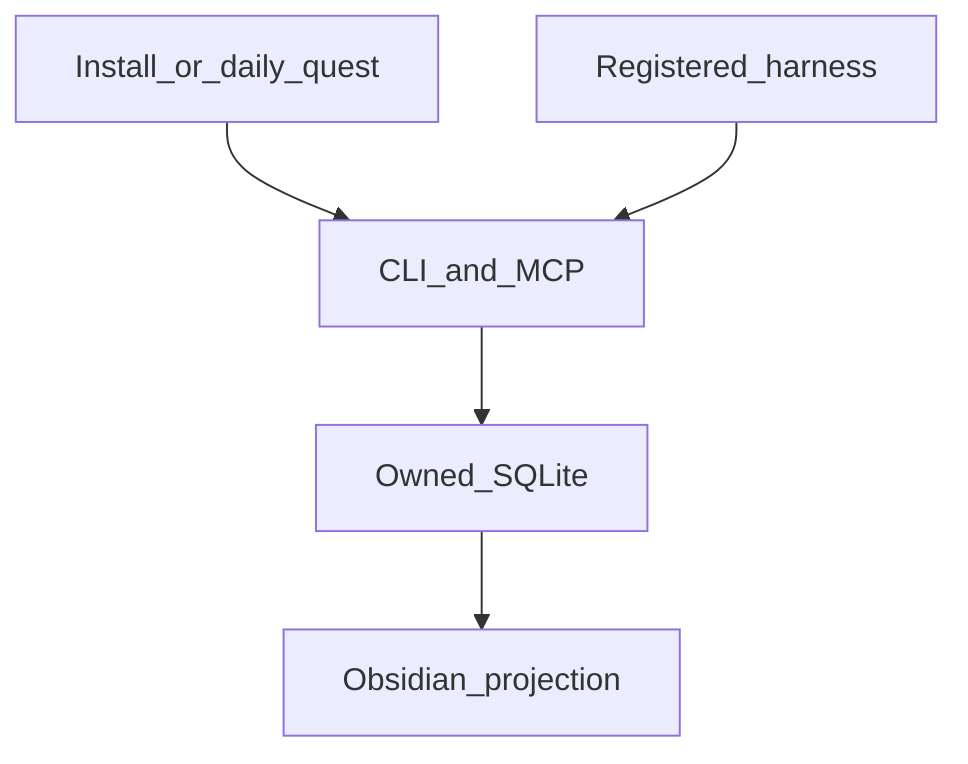

[English](README.md) · [中文](README.zh-CN.md)

# With.

Things that stay with you.

With is a persistent memory layer for your harness.

The source of truth is an owned SQLite file on your machine. People look at an Obsidian vault. Every tool talks to the same CLI or stdio MCP. Facts are invalidated, not deleted.

The product is **With.** The command is still `eric-memory`, so existing installs keep working.

## Stay

A current fact is `active`. A retired fact is `deprecated` plus `superseded_by`. Default search does not treat history as current. Nothing is erased to make a new present.

That is the whole philosophy, in one line: leave what was true, and write what is true now.

## Architecture



No app. No cloud. No login daemon. No admin rights. Zero third-party runtime packages. Python 3.10+ is enough.

## Two tiers

| Tier | Who | How |
| --- | --- | --- |
| Simple | Anyone installing on their own machine | Paste [`quests/en/install.md`](quests/en/install.md) into the AI you already use. Then open the Obsidian home note. Run the daily quest when you want the vault refreshed. |
| Full | Maintainers | The same, plus a read-only Holograph import, tests, and adapters. |

Guides: [Introduction](docs/en/introduction.md) · [Simple](docs/en/simple.md) · [Full](docs/en/full.md) · [CLI and MCP](docs/en/cli-mcp.md) · [Windows / Linux](docs/en/windows-linux.md)

Chinese copies live next to them in [`docs/`](docs/) and [`quests/`](quests/).

## Install

```bash
python3 -m unittest discover -s tests -q
python3 scripts/repo_check.py
python3 bin/eric-memory --version
python3 bin/eric-memory --data-dir "$HOME/eric-memory-data" init --tier simple
python3 bin/eric-memory --data-dir "$HOME/eric-memory-data" status
```

On Windows use `py -3` and `%USERPROFILE%\eric-memory-data`. Expand `~` once at init. After that, only absolute paths.

Or skip the terminal: give [`quests/en/install.md`](quests/en/install.md) to your harness and answer the questionnaire.

The data directory never enters Git.

## Official surface

| Action | CLI | MCP |
| --- | --- | --- |
| Initialize | `init` | (once, from the install quest) |
| Status | `status` | `memory_status` |
| Write | `add` | `memory_add` |
| Search | `search` | `memory_search` |
| Invalidate | `deprecate` | `memory_deprecate` |
| Sync | `sync` | `memory_sync` |
| Import | `import holograph --source …` | `memory_import` |
| Index a folder | `index-files` | `memory_index_files` |
| Register a tool | `harness add` | `memory_harness_add` |
| List registered tools | `harness list` | `memory_harness_list` |

Do not `INSERT` into `memory.db` by hand. The contract is [skills/严格技能.md](skills/严格技能.md). A Cursor template is [.cursor/mcp.json.example](.cursor/mcp.json.example).

## What v1 will not do

- Use Mem0, Graphiti, Cognee, or Supermemory as the kernel
- Treat Obsidian as the source of truth
- Scan the whole disk in silence
- Treat a vendor leaderboard as acceptance
- Ship a client zip, a cloud, or a background service

## License

[MIT](LICENSE)
