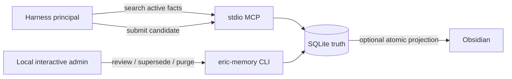

[English](README.md) · [中文](README.zh-CN.md)

# With.

With is a persistent memory layer for your harness.

SQLite is the only source of truth. The CLI, local interactive review terminal, and stdio MCP are the product; Obsidian is an optional projection. The command remains `eric-memory` for v1 compatibility.

> Release status: this checkout is still version `0.1.0`, not a signed `1.0.0` GA release. The production kernel and release gates are implemented, but GA remains blocked until the embedded release trust root, four native signed artifacts, real six-harness evidence, and independent reviews exist for one frozen commit.

## Trust model



- A normal harness can search authorized scopes and submit candidates. It cannot silently create active facts.
- A local administrator accepts or rejects candidates with `review`. Fact bodies are immutable; evolution creates a new fact and deprecates the old one.
- Credentials, private keys, high-entropy tokens, cookies, long source text, and suspected minor-performance records are rejected or redacted before persistence.
- The security boundary is the OS account. Software with arbitrary shell access as the same account is effectively a local administrator.
- No command uses the network except an explicit `update check` or `update apply`. There is no telemetry or daemon.

## Source installation

Python 3.10+ is required. Runtime dependencies are locked in [`pyproject.toml`](pyproject.toml).

```bash
python3 -m venv .venv
.venv/bin/python -m pip install --upgrade "pip==26.2.1"
.venv/bin/python -m pip install .
.venv/bin/eric-memory --data-dir "$HOME/eric-memory-data" init --no-obsidian
.venv/bin/eric-memory --data-dir "$HOME/eric-memory-data" doctor
```

Windows uses `.venv\Scripts\python.exe` and `.venv\Scripts\eric-memory.exe`. Expand the data path once; persisted paths must be absolute. Installation does not require administrator rights or modify `PATH` automatically.

## Trusted memory loop

```bash
eric-memory --data-dir "$HOME/eric-memory-data" search "current project" --scope user
eric-memory --data-dir "$HOME/eric-memory-data" candidate add \
  --content "The current project entry is /absolute/path; review before activation." \
  --entities "With" --scope user
eric-memory --data-dir "$HOME/eric-memory-data" review
eric-memory --data-dir "$HOME/eric-memory-data" backup create
```

An MCP configuration must identify its harness:

```text
eric-memory --data-dir /ABS/eric-memory-data mcp --principal cursor
```

Omitting `--principal` selects the migration-safe `legacy` identity: status and search only. Register a principal with `harness add`; default grants are least-privilege. Approve file sources only from the local interactive CLI.

## Guarantees and boundaries

- Schema v2 uses stable UUIDs while preserving integer fact IDs and existing command/JSON names.
- Non-`init` commands never create a missing database; read commands open SQLite read-only.
- Migration is side-by-side and atomically replaces the database only after validation and backup.
- Search filters ACL, scope, and status before versioned hybrid ranking.
- Backups, restore, purge, source consent/revocation, operation IDs, redacted support bundles, and atomic projection are built in.
- `--tier simple|full` remains accepted during v1 but is ignored with a deprecation warning; there is one unified mode.

## Documentation

- [Optional working context](docs/en/working-context.md): native, project-authorized temporary documents and bounded recall through the existing MCP; no additional runtime dependency.

- [CLI and MCP](docs/en/cli-mcp.md)
- [Install and upgrade](docs/en/install-upgrade.md)
- [Migration, backup, and restore](docs/en/migration-backup-restore.md)
- [Privacy and threat model](docs/en/privacy-threat-model.md)
- [Emergency purge](docs/en/purge.md)
- [Troubleshooting and support](docs/en/troubleshooting-support.md)
- [Release process and GA gates](docs/en/release-process.md)
- [Architecture](docs/en/architecture.md)

The mandatory harness contract is [skills/严格技能.md](skills/严格技能.md). Do not edit `memory.db` directly or walk unapproved directories.

## Non-goals for v1

Cloud sync, accounts, multi-user collaboration, HTTP MCP, a desktop app, background services, local models, and vector databases are deliberately out of scope.

## License

[MIT](LICENSE)
