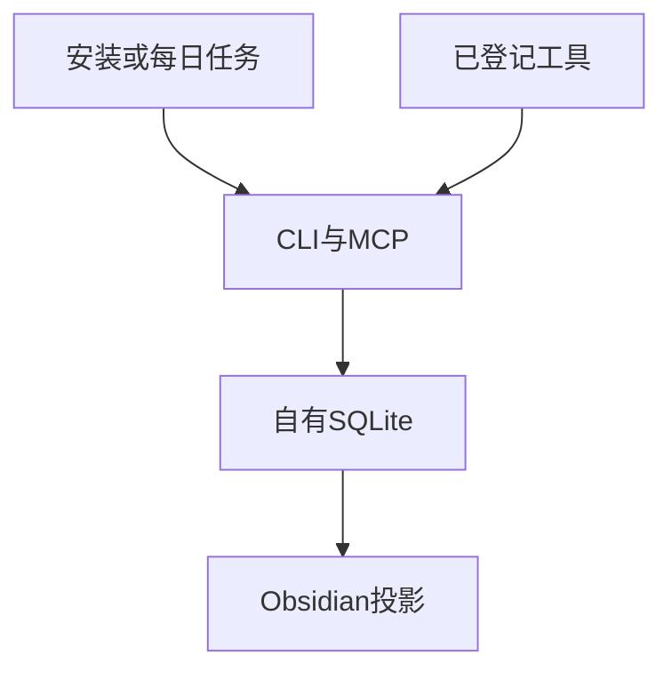

[English](README.md) · [中文](README.zh-CN.md)

# With.

留下来的东西。

With 是给你手头 harness 用的持久记忆层。

机器真值是本机自有的 SQLite。人看的窗口是 Obsidian。各家工具走同一条 CLI 或 stdio MCP。事实被作废，不被删除。

产品叫 **With.** 命令仍是 `eric-memory`，以免现有安装断掉。

## 留下

现行是 `active`。历史是 `deprecated` 加 `superseded_by`。默认搜索不会把过期条当成现行。没有什么会被抹掉，好腾出新的现在。

整段哲学就一句：留下曾经为真的，写下此刻为真的。

## 架构



不做 App。不做云。不装开机守护。不要管理员。零第三方运行时包。Python 3.10+ 即可。

## 两档

| 档 | 给谁 | 怎么用 |
| --- | --- | --- |
| 简易 | 自己装在自己电脑上的人 | 把 [`quests/安装任务.md`](quests/安装任务.md) 贴给手头的 AI。然后开 Obsidian「记忆首页」。要刷新时跑每日任务。 |
| 完整 | 维护者 | 同上，外加只读导入 Holograph、跑测试、补 adapter。 |

说明：[简介](docs/en/introduction.md) · [简易](docs/简易.md) · [完整](docs/完整.md) · [CLI 与 MCP](docs/en/cli-mcp.md) · [Windows / Linux](docs/windows-linux.md)

英文副本在 [`docs/en/`](docs/en/) 和 [`quests/en/`](quests/en/)。

## 安装

```bash
python3 -m unittest discover -s tests -q
python3 scripts/repo_check.py
python3 bin/eric-memory --version
python3 bin/eric-memory --data-dir "$HOME/eric-memory-data" init --tier simple
python3 bin/eric-memory --data-dir "$HOME/eric-memory-data" status
```

Windows 用 `py -3` 和 `%USERPROFILE%\eric-memory-data`。`~` 只在 `init` 时展开一次。之后只用绝对路径。

也可以不碰终端：把 [`quests/安装任务.md`](quests/安装任务.md) 交给你的 harness，按问卷回答。

数据目录永不进 Git。

## 官方入口

| 动作 | CLI | MCP |
| --- | --- | --- |
| 初始化 | `init` | （安装任务执行一次） |
| 状态 | `status` | `memory_status` |
| 写入 | `add` | `memory_add` |
| 检索 | `search` | `memory_search` |
| 作废 | `deprecate` | `memory_deprecate` |
| 同步 | `sync` | `memory_sync` |
| 导入 | `import holograph --source …` | `memory_import` |
| 索引资料夹 | `index-files` | `memory_index_files` |
| 登记工具 | `harness add` | `memory_harness_add` |

禁止对 `memory.db` 私自 `INSERT`。合同见 [skills/严格技能.md](skills/严格技能.md)。Cursor 模板见 [.cursor/mcp.json.example](.cursor/mcp.json.example)。

## 第一版明确不做

- 不把 Mem0 / Graphiti / Cognee / Supermemory 当内核
- 不把 Obsidian 当真值
- 不静默扫描全盘
- 不把厂商基准分当验收
- 不打客户 zip、不做云、不装后台服务

## License

[MIT](LICENSE)
