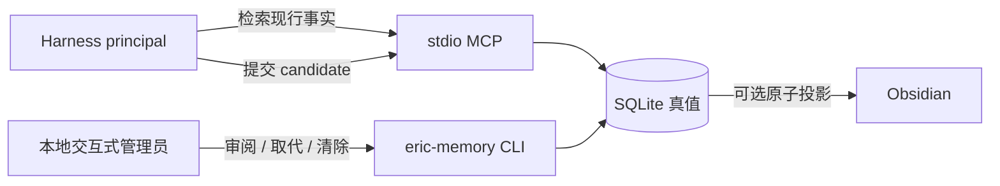

[English](README.md) · [中文](README.zh-CN.md)

# With.

With 是给 harness 使用的本地持久记忆层。

SQLite 是唯一真相源。CLI、本地交互式审阅终端和 stdio MCP 构成产品；Obsidian 只是可选投影。为保证 v1 兼容，命令继续叫 `eric-memory`。

> 发行状态：当前代码版本仍是 `0.1.0`，尚未发布签名的 `1.0.0` GA。生产内核与发布门禁已经实现，但只有在同一冻结 commit 上具备内置发布信任根、四个平台签名产物、六类真实 harness 测试结果和独立审阅后，才允许标记 GA。

## 信任模型



- 普通 harness 只能检索获准 scope、提交 candidate，不能静默写入 active。
- 本地管理员通过 `review` 接受或拒绝。事实正文创建后不可改写；演进会创建新事实并将旧事实标为 deprecated。
- 凭据、私钥、高熵 token、cookie、长篇原文和疑似未成年人个体表现会在持久化前被拒绝或脱敏。
- 系统保护依赖 OS 账户；拥有同账户任意 shell 的程序等价于本地管理员。
- 除非用户显式执行 `update check` / `update apply`，程序不联网；没有遥测或后台守护。

## 从源码安装

需要 Python 3.10+，运行时依赖锁定在 [`pyproject.toml`](pyproject.toml)。

```bash
python3 -m venv .venv
.venv/bin/python -m pip install --upgrade "pip==26.2.1"
.venv/bin/python -m pip install .
.venv/bin/eric-memory --data-dir "$HOME/eric-memory-data" init --no-obsidian
.venv/bin/eric-memory --data-dir "$HOME/eric-memory-data" doctor
```

Windows 使用 `.venv\Scripts\python.exe` 与 `.venv\Scripts\eric-memory.exe`。数据路径必须在写入前展开为绝对路径。安装不要求管理员权限，也不会自动修改 `PATH`。

## 记忆提交与审阅

```bash
eric-memory --data-dir "$HOME/eric-memory-data" search "当前项目" --scope user
eric-memory --data-dir "$HOME/eric-memory-data" candidate add \
  --content "当前项目入口是 /绝对/路径；激活前需要审阅。" \
  --entities "With" --scope user
eric-memory --data-dir "$HOME/eric-memory-data" review
eric-memory --data-dir "$HOME/eric-memory-data" backup create
```

MCP 配置必须携带 harness 身份：

```text
eric-memory --data-dir /绝对路径/eric-memory-data mcp --principal cursor
```

不提供 `--principal` 时进入迁移安全的 `legacy` 身份，只能 status 和 search。用 `harness add` 创建 principal，默认授权遵循最小权限。文件来源只能从本地交互式 CLI 批准。

## 已实现的功能及限制

- schema v2 增加稳定 UUID，同时保留整数 fact ID、原命令名和 JSON 字段。
- 除 `init` 外，命令不会创建缺失数据库；读命令以只读 URI 打开 SQLite。
- 迁移在旁路临时库完成，只有备份和校验成功后才原子替换。
- 检索先做 ACL、scope、status 过滤，再执行版本化混合排序。
- 内置备份、恢复、紧急清除、来源同意/撤销、operation UID、脱敏支持包和原子投影。
- v1 期间仍接受 `--tier simple|full`，但只给弃用提示；系统已统一为一个模式。

## 文档

- [CLI 与 MCP](docs/CLI与MCP.md)
- [安装与升级](docs/安装与升级.md)
- [迁移、备份与恢复](docs/迁移备份与恢复.md)
- [隐私与威胁模型](docs/隐私与威胁模型.md)
- [紧急清除](docs/紧急清除.md)
- [故障排查与支持](docs/故障排查与支持.md)
- [发布流程与 GA 门禁](docs/发布流程.md)
- [架构（英文）](docs/en/architecture.md)

harness 的强制契约见 [skills/严格技能.md](skills/严格技能.md)。禁止直接编辑 `memory.db`，也禁止遍历未批准目录。

## v1 非目标

云同步、账号、多人协作、HTTP MCP、桌面 App、后台服务、本地模型和向量数据库都明确不在 v1 范围内。

## License

[MIT](LICENSE)
