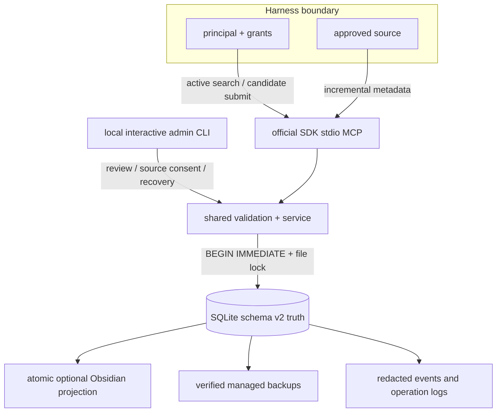

[English](architecture.md) · [中文](../../README.zh-CN.md)

# Architecture

## Storage kernel

The connection boundary has read-only, read/write-existing, and create modes. All state changes use one write transaction primitive and a cross-platform lock. Facts retain integer IDs and gain stable UIDs. Fact bodies are immutable. Active uniqueness is `(normalized_content_hash, scope_fingerprint)`; the same sentence may exist in separate scopes. Supersession is an explicit acyclic graph.

Schema v2 separates principals/grants, structured scopes, sources/source files/scan runs, candidate lifecycle, fact-source links, supersessions, audit events, and change events. Events identify objects and operations without duplicating fact bodies.

## Trusted write path

A normal harness can only produce a pending candidate from an assigned source. Content policy runs before persistence. Local review accepts or rejects; acceptance creates the fact, optional supersession links, audit/change events, and source link in one `BEGIN IMMEDIATE` transaction. Projection happens after the authoritative commit and reports dirty state independently.

## Retrieval

Optional [working context](working-context.md) is implemented by `ContextService` and `ContextStore`, exposed through the same CLI/MCP. A library-bound `context/working.sqlite3` stores explicitly enabled project sources and expiring document snapshots; schema-v2 durable facts require no migration. `context:read` and `context:write` are opt-in project grants. The existing `memory_search` behavior is preserved, while `memory_recall` returns bounded, labeled project facts and document excerpts. Readers recheck source consent and project grants; writers additionally require ownership of the approved source. No subprocess execution or automatic fact promotion is added.

ACL, scope, and status are applied before ranking. Candidate sets come from exact entity, aliases, CJK unigram/bigram plus Latin tokens, FTS5/BM25, and escaped literal LIKE. Versioned weighted reciprocal-rank fusion combines every channel. Entity hits never short-circuit the other channels. Deprecated rows require explicit history permission.

## Source indexing

Consent records the canonical root and rules. Scans use `lstat`, reject symbolic links, re-check containment, skip unchanged files by mtime/size, and hash only changed regular files. Missing records become stale. A truncated walk is an explicit failed run and never advances the cursor. File/session bodies are not stored.

## Migration and recovery

Migration builds and validates a separate database before atomic replacement. Backups use SQLite's backup API and carry hashes/metadata. Restore is also side-by-side. Purge is an exceptional local workflow that removes target content, managed copies, WAL/projection remnants, then compacts and verifies the database.

## Distribution boundary

Runtime resources use package resources, not repository-relative writes. `bin/eric-memory` and `mcp/server.py` remain v1 shims. Native PyInstaller onedir builds are produced independently on four target platforms. No daemon, cloud API, HTTP listener, account system, vector database, or telemetry exists in v1.
