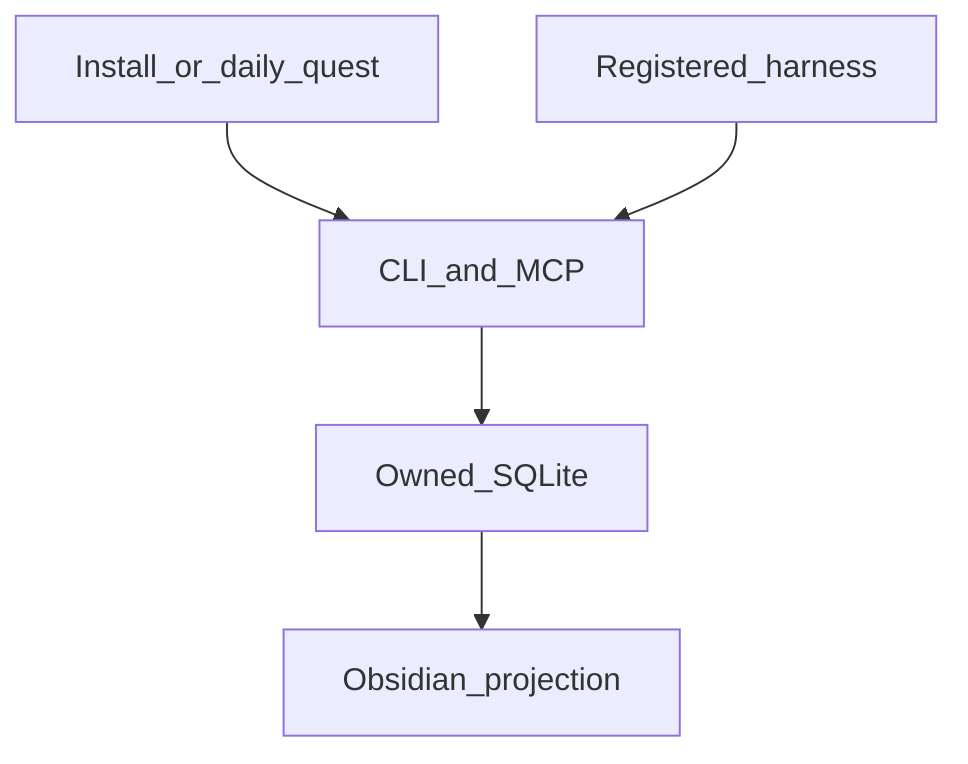

[English](architecture.md) · [中文](../完整.md)

# Architecture

## Truth

`memory.db` inside the data directory is the only source of truth. Schema lives in the Python package. Writes go through `MemoryService`. There is no second writer.

A fact has `status`. `active` is current. `deprecated` is history. `superseded_by` points at the row that replaced it. Simple tier has no purge.

## Search

1. Entity names first.
2. If the query has CJK, LIKE with AND across tokens.
3. Latin queries use FTS5, then LIKE on a miss.

Default filters to `active`. Pass `--include-deprecated` when you need the trail.

## Projection

`sync` and every write path refresh the vault: home, current, expired, folders, harnesses. Notes are generated. Editing them in Obsidian does not change the database.

## Harvest

Daily sync only reads directories that are registered, have an absolute `session_root`, and have `harvest_ok`. The catalog is open. Unknown tools are added with the add-harness quest, not by forking the kernel.

File indexers store paths, not file bodies.

## Import

Full tier can import a read-only Holograph `memory_store.db`. Rows keep their deprecated tags. Untagged rows become `active` with `as_of` set to the import day. Dedup key is `source_kind=import` plus `source_ref=holograph:<id>`. The old file is never written.

## Boundaries

No daemon. No cloud API. No admin install. No default full-disk walk. MCP is stdio with `Content-Length` frames. CLI and MCP expose the same verbs.
